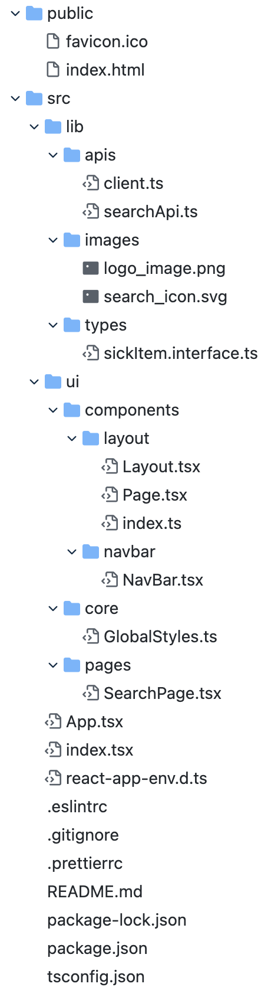

# 원티드 프리온보딩 인턴십 과제 - 검색창

## 목표

검색창 구현 + 검색어 추천 기능 구현

👉[한국임상정보](https://clinicaltrialskorea.com/) 사이트의 검색영역 클론하기

<br><br>

## 배포 링크
[🎯프로젝트 배포 링크](https://clinquant-gumption-42dd8c.netlify.app/)

<br><br>

## 프로젝트 실행 방법

### 설치 및 실행

```md
git clone https://github.com/ShinjungOh/wanted-pre-onboarding-search 

npm install
npm start
```

<br><br>

## 디렉토리 구조




<br><br>

## 프로젝트 설명

- [x] 한국임상정보 사이트의 검색 영역을 클론했습니다.
- [x] 질환명 검색 시 API 호출을 통해 검색어를 추천해주는 기능을 구현했습니다.   
  - [x] 사용자가 입력한 텍스트와 검색 결과의 일치하는 부분을 볼드처리 했습니다.
  - [x] 검색 결과가 없을 시 검색어 추천 영역에 `검색 결과가 없습니다` 메시지가 표출됩니다.
  - [x] 검색어를 입력할 때 활성화되는 취소 버튼을 누르면 입력 중인 데이터와 검색 결과가 삭제됩니다.
- [x] API 호출 최적화
    - [x] API 호출별로 로컬 캐싱되도록 구현했습니다.
      - state를 생성하고 API를 조회하면 state에 key 값으로 키워드, value 값으로 검색 결과 배열을 반영해주도록 했습니다.
      - state의 key 값 중 검색어가 있을 경우 API 호출이 일어나지 않고 해당 state에서 값을 가져오도록 되어있습니다.
    - [x] 입력마다 API 호출하지 않도록 debounce 기법을 사용해 불필요 API 요청 방지 기능을 구현했습니다.
      - 검색창에 0.4초간 입력이 되지 않으면 API를 요청합니다. 이전의 요청은 삭제되고 마지막 요청만 전송됩니다.
    - [x] API를 호출할 때 마다 `console.info("calling api")` 출력을 통해 콘솔창에서 API 호출 횟수 확인이 가능하도록 구현했습니다.
- [x] 키보드만으로 추천 검색어들로 이동 가능하도록 구현했습니다.
  - tabindex 속성을 이용해 입력창, 취소버튼, 검색버튼, 검색 결과 순으로 tab 이동이 가능하도록 구현했습니다.

<br><br>

## 개발 조건 및 환경

`npx create-react-app --template typescript`  

TypeScript, React, axios, styled-components 
